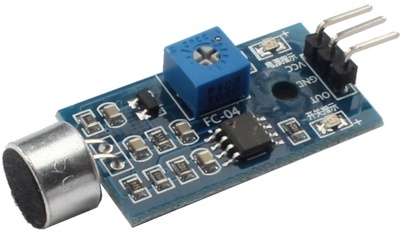

# SoundDetector
Projects using the Daoki Sound Sensor: 

Ideas and initial code taken from: [Piddler In The Root](http://www.piddlerintheroot.com/sound-sensor/)

We have projects based on these boards:
- [RaspberryPI](RaspberryPI);
- [ESP32](esp32);
