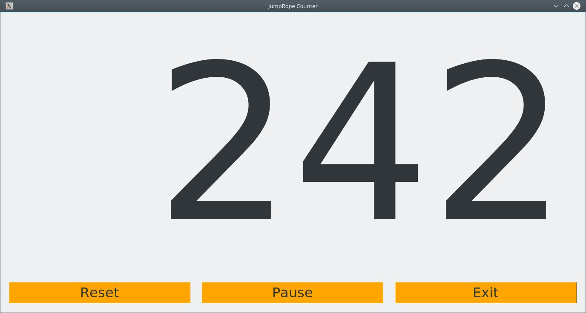

# Projects using the [RaspberryPI](https://www.raspberrypi.org/products/):

- JumpRopeCounter:
  Try to detect the sound of the rope hitting the floor and using that as a trigger to keep count of how many times you jumped since you pressed a start/stop button. 
  
